University: [ITMO University](https://itmo.ru/ru/)  
Faculty: [FICT](https://fict.itmo.ru)  
Course: [Network programming](https://github.com/itmo-ict-faculty/network-programming)  
Year: 2024/2025  
Group: K3321  
Author: Vdovina Yaroslava Dmitrievna  
Lab: Lab1  
Date of create: 02.10.2025  
Date of finished: 02.10.2025  

## Настройка сервера
- Вместо облачного сервера развернула виртуальную машину с убунтой в виртуал боксе  
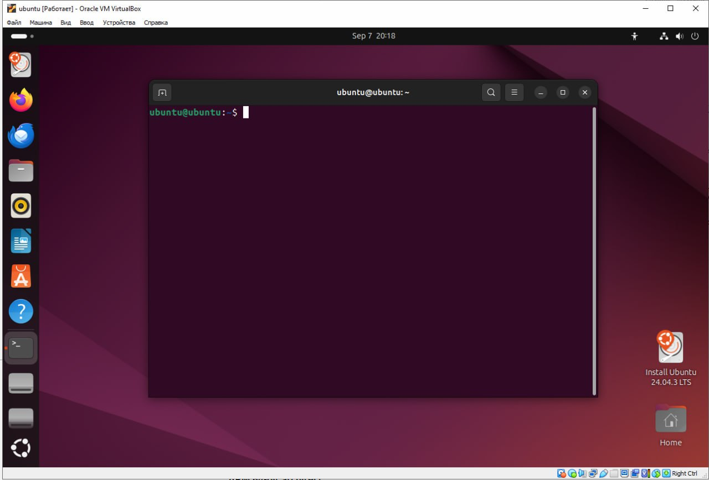
- Установила питон и ансибл
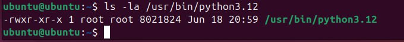
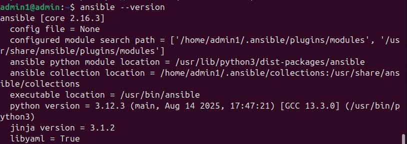
- Установила Wireguard и сгенерировала ключи для сервера на убунте  
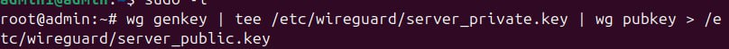
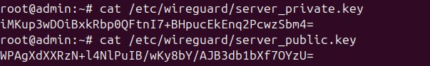
- заполнила конфиг для Wireguard  
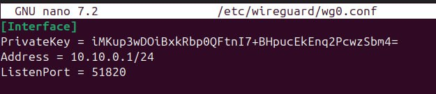
## Настройка клиента в CHR и подключение к vpn
- В виртуал боксе была поднята ещё одна виртуальная машина на этот раз с микротиком  
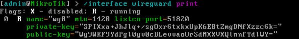
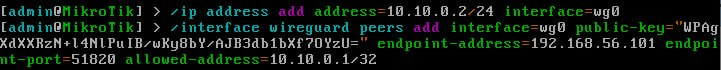
- Созданный для микротика ключ прописала в конфиг на убунте  
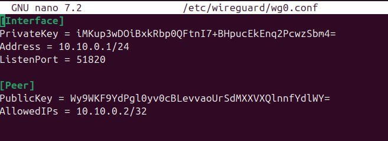
- Пинги с убунты и микротика:  
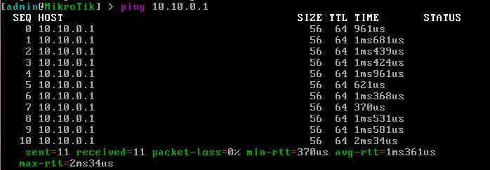
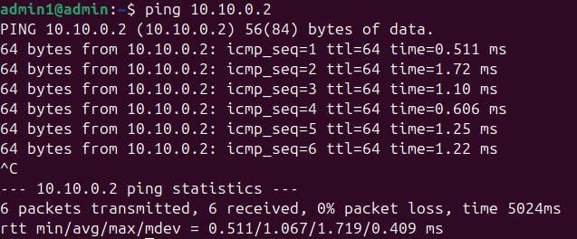

