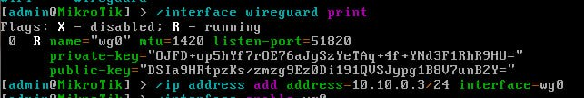

University: [ITMO University](https://itmo.ru/ru/)  
Faculty: [FICT](https://fict.itmo.ru)  
Course: [Network programming](https://github.com/itmo-ict-faculty/network-programming)  
Year: 2024/2025  
Group: K3321  
Author: Vdovina Yaroslava Dmitrievna  
Lab: Lab2  
Date of create: 02.10.2025  
Date of finished: 02.10.2025  

## Настройка второго клиента в CHR
- В виртуал боксе была поднята ещё одна виртуальная машина со вторым микротиком и были повторены настройки с lab 1  

- Был создан playbook, который создаёт пользователя ансибл, включает ntp-клиент, настраивает ospf interface template для нашего соединения WG с типом ptp, открывает в firewall ospf и udp порт WG, после собирает данные об ospf топологии и полный конфиг устройств

- Проверка соседства на самих микротиках:  

