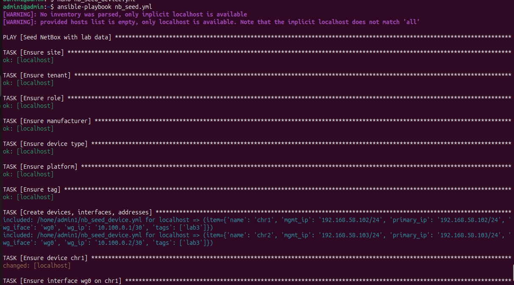
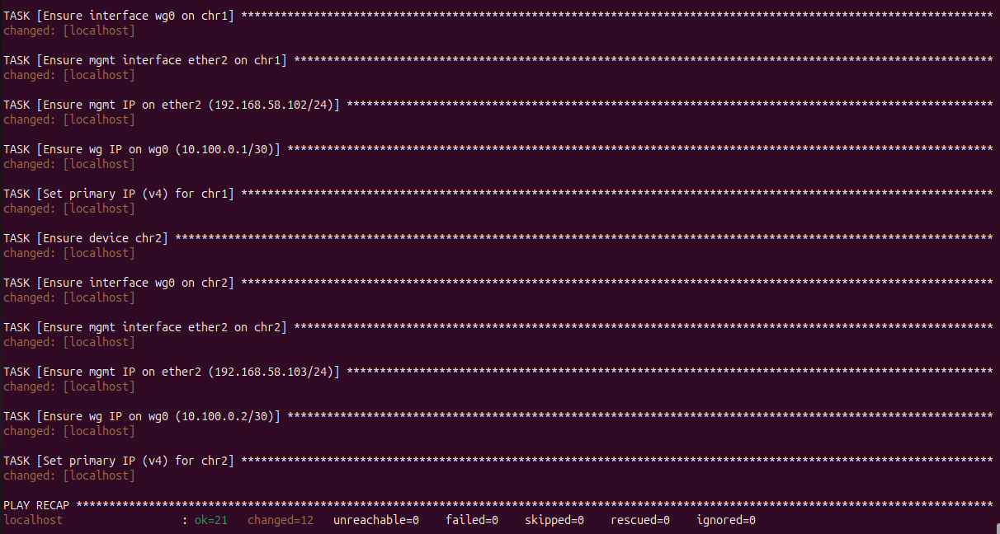
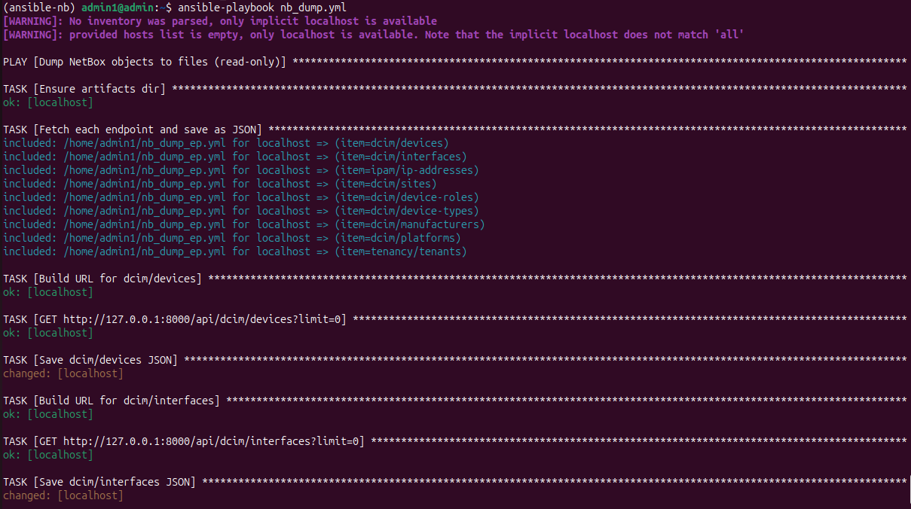
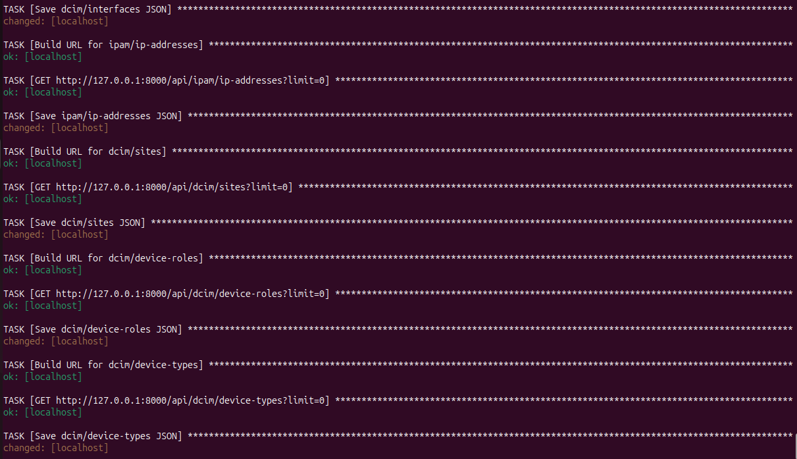
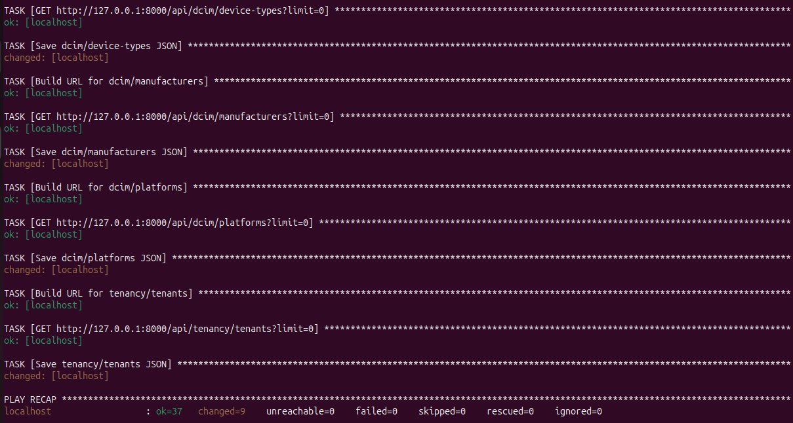
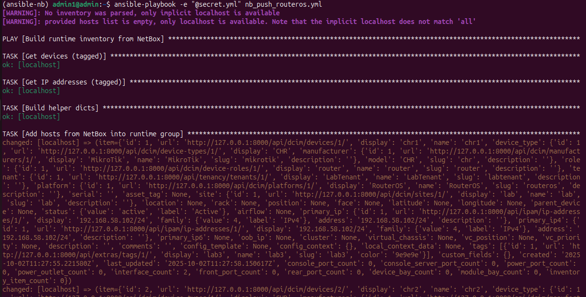
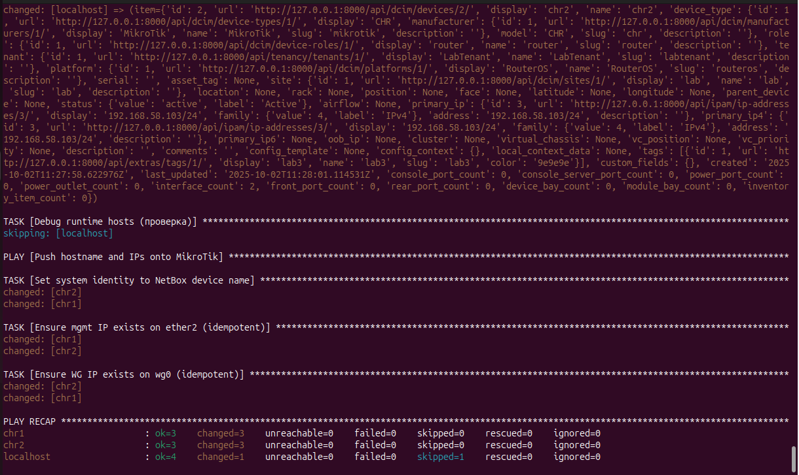
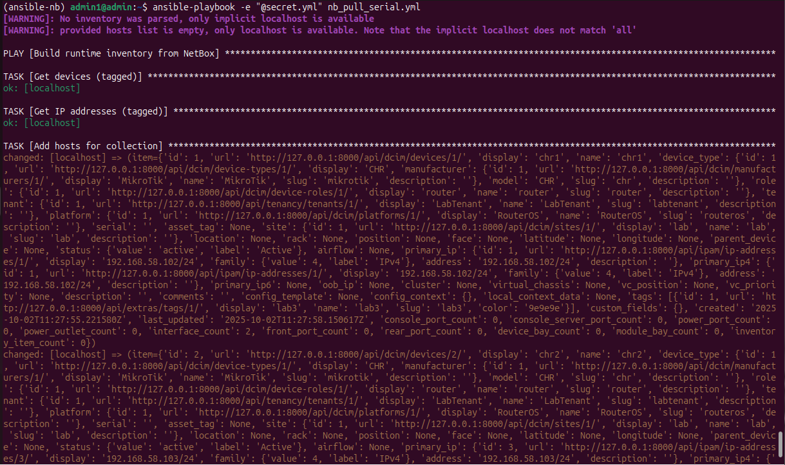
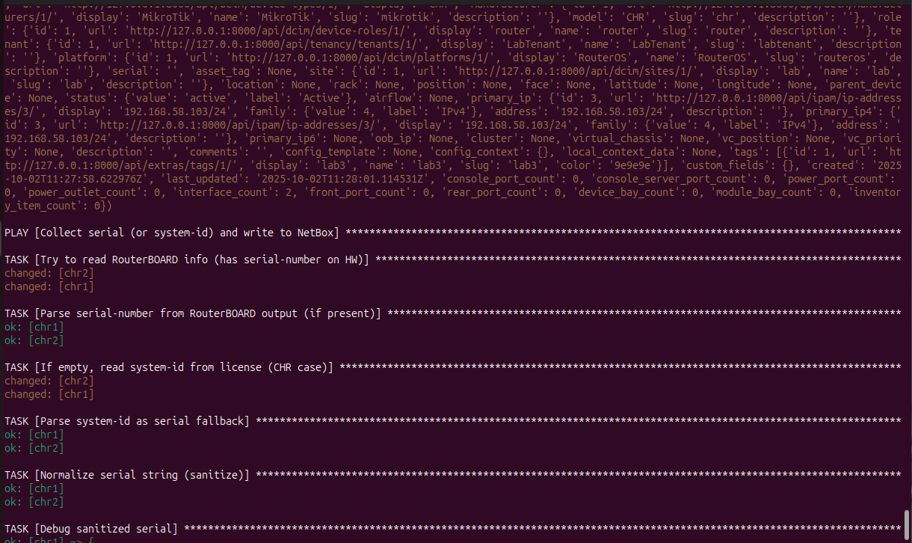
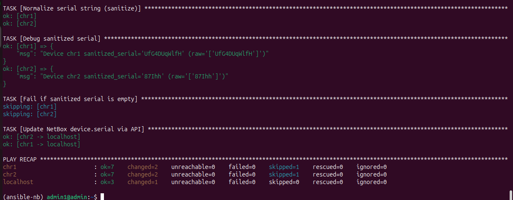

University: [ITMO University](https://itmo.ru/ru/)  
Faculty: [FICT](https://fict.itmo.ru)  
Course: [Network programming](https://github.com/itmo-ict-faculty/network-programming)  
Year: 2024/2025  
Group: K3321  
Author: Vdovina Yaroslava Dmitrievna  
Lab: Lab3  
Date of create: 02.10.2025  
Date of finished: 02.10.2025  

## Работа с NetBox
- Был развёрнут NetBox с помощью docker compose по адресу http://127.0.0.1:8000 (локально)

- В нетбоксе была заполнена информация о двух микротиках: Site, Tenant, Manufacturer (MikroTik), Device Type (CHR), Platform (RouterOS), Role (router), Tag (lab3)
## Ансибл сценарии

- nb_seed.yml — заполняет NetBox начальными объектами (site, manufacturer, device type, devices, interfaces, IP)

- nb_dump.yml — получение данных из NetBox и сохранение JSON

- nb_push_routeros.yml — строит инвентори из NetBox и конфигурирует микротик (имя устройства, IP и т.д.) по данным NetBox

- nb_pull_serial.yml —  считывает серийники с микротика и записывает их обратно в NetBox

